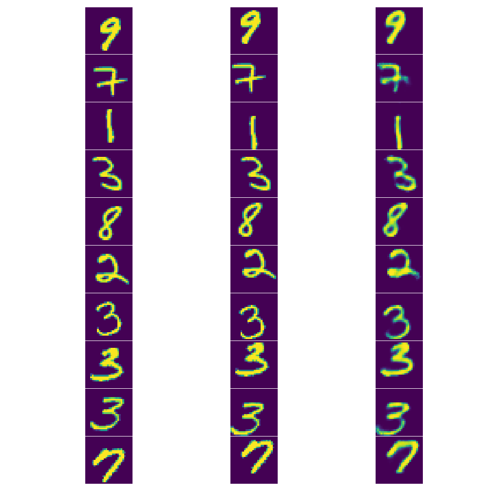

# Transforming-Autoencoder-TF

This is a tensorflow implementation of the Transforming Autoencoders.

The paper (http://www.cs.toronto.edu/~fritz/absps/transauto6.pdf) provides technical details of the model.

    Transforming Auto-encoders
    Hinton, Geoffrey E. and Krizhevsky, Alex and Wang, Sida D.
    http://dl.acm.org/citation.cfm?id=2029556.2029562

The architecture uses capsules to recognize an implicitly defined visual entity over a domain of viewing conditions. It outputs both the probability that a particular visual entity is present and a set of "instantiation parameters" like pose, lighting and deformation of the visual entity relative to a canonical version of that entity. When this architecture is trained, the probability of visual entity is invariant as the entity moves over the manifold of possible appearances. The instantiation parameters, however, are "equivariant" -- parameters change by a corresponding amount as the viewing conditions change. 

<p align="center"></p>

## Source

+ `capsule.py` is the complex capsule which recognizes and generates the respective visual entity. The recognition and generation weights are learnt in a self-supervised manner.
+ `trans_ae.py` creates the above capsules for all visual entities in the data
+ `train_model.py` Trains and validates the code

### Train
```
python main.py
```
Default hyperparameters used:
* num-capsules 60
* generator-dimen 20
* recognizer-dimen 10
* num-epochs 800
* save-pred-every 20
* save-checkpoint-every 200
* batch-size 100

## Sample MNIST results from this implementation

Column 1 is the input and Column 2 is the expected output after translation. Column 3 represents the output generated from the transforming autoencoder after training for 800 epochs.



